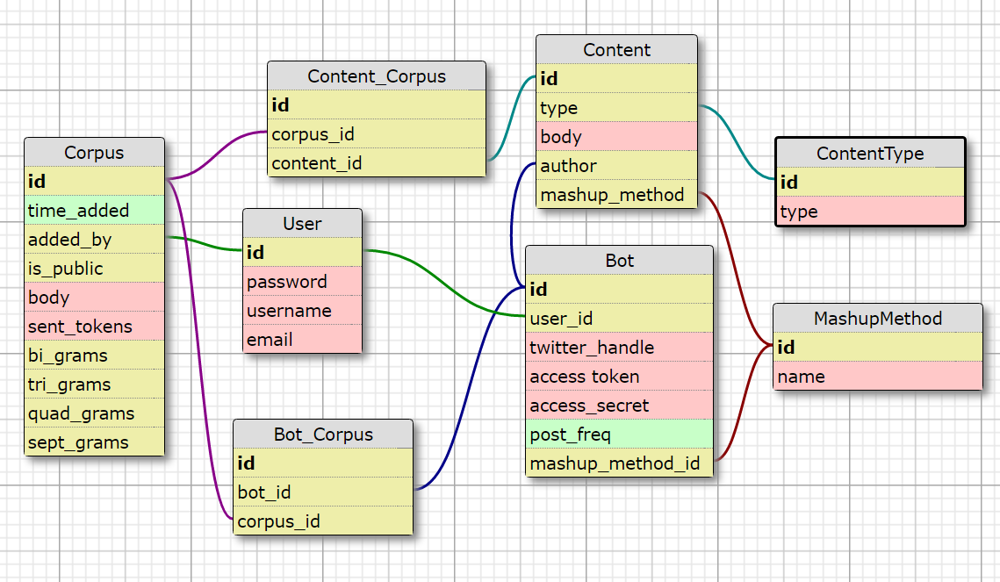

# Ewe Ebooks

A Django based admin for creating, configuring, and managing Twitter mashup bots.

## Overview
By creating an easy to use front end for creation and maintenance of Twitter bots, Ewe Ebooks brings the horse ebooks experience to everyone.  Users can upload their own source material or choose twitter accounts as sources. Then, using a simple user interface, users can easily configure the sources, frequency, and algorithms used to combine their content, then watch as it is automatically posted to twitter on their behalf.

## Specific Functionality
### Main management page:
* Tabular list of bots configured by this user. Fields are bot_name, last_post_time, content_sources, truncated last_post, and link to individual bot management page.

### Individual bot management page:
Django form page with the following elements:

* Generate a tweet button (user can press to generate sample content, shows a dummy tweet with avatar, etc. Used to play with settings)
* Twitter API Elements
* Tabular list of toggleable sources used to seed this bot. User can turn source inclusion on and off
* Link to add a new corpus
* Content generation method controls:N-gram length. chain on stopword or shared non-stopword. Shortest tweet length.  Longest tweet length. Autogen hashtag?</ul>

### Corpora Mangement Page
Tabular list of current corpora configured by the user, with the fields: corpus_name, total_words, total_sentences, and link to edit/deleted corpus.

At top of page, "add source" button and dropdown select for user-generated source or twitter account. If twitter is selected,  a textbox with the "Twitter Screen Name" and an add button will appear.

## Technical Components

* Django and postgreSQL based back-end for managing user accounts, bot objects and source material corpora.
* Python NLTK-based sentence, word, and N-gram tokenizing.
* Uses tweepy Twitter API wrapper for posting bot tweets and seeding user based corpora
* Front-end made with bootstrap css, javascript, ajax, jquery and jqueryUI.

## Schedule
#### Week 1
Creation and testing of business algorithms. Study into NLTK and markov chain bots. Configurable features will be brainstormed and built out from here. Getting started on this early will help me prioritize the rest of the project, and this tough and crucial functionality drives the rest of the project.

#### Week 2
 Continue tweaking core bot functionality. Start Django project and get database schema into place.

#### Week 3

#### Week 4

## Models to Create:

##### User
_password/username/email_
##### Corpus
 Where source material is stored

`time_added, added_by, is_public, body, sent_tokens, bi-, tri-, quad-, septgrams`

##### Bot
Collection of mashup algorithm, corpora, and twitter identity

`user_id, twitter_handle, access_token, access_secret, post_freq, mashup_method_id`

##### Bot_Corpus
M2M table for selecting corpora to seed Bot instances

`bot_id, corpus_id`

##### Content
Log of generated content. features type field for including tweets, API calls, etc

`type, body, author (should probably be bot_id), mashup_method`

##### ContentType

Dependent model to Content with list of various content sources like twitter, REST api, console, etc

`type`

##### Content_Corpus
M2M linking corpora and the Content generated from them

`content_id, corpus_id`

##### MashupMethod
Contains a list of the various combinatoric methods

`name`

#### Database Schema

## Apps

## Mashup Algorithms
_Mouse Join_ - method used by
[Mouse Reeve](https://github.com/mouse-reeve/) on [new facts bot](https://twitter.com/brand_new_facts)
uses nltk.pos_tag and pivots on verb tag.

_Common clause pivot_ split sentences on tokens that set off dependent clasuses like "because," "but," "however," etc. Then join clauses from corpora at these elements.

_Forced POS Madlib_ - Create archetypal sentence from one document and seed it with matching POS-tagged words
drawn randomly from the included corpora

_ParseyMcParseFace_ - Uses google's grammar parser to try to output grammatical sentences from randomly selected words.

## Endpoints
* /random/ - Generate  tweet from randomly selected corpora using randomly
  selected method. Cites sources and method in JSON response

* /bot/botname/ Give users a REST endpoint for generating on_demand content bots

##Future Features
Hashtag generator - Randomly select words that appear frequently in both corpora
and mash them together, prepending a #

##Research Dump
Good way to store NLTK tokens after parsing?
Dataset module:
https://dataset.readthedocs.io/en/latest/

Maybe a custom model field in django?
https://docs.djangoproject.com/en/1.10/howto/custom-model-fields/
